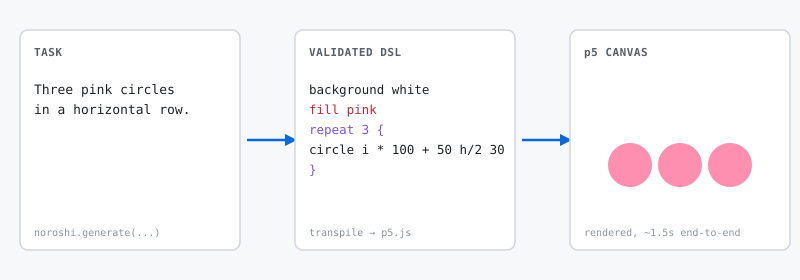

# オンデバイス LLM × 新規 DSL: 1.5B モデルで fine-tuning なしに 85% を出す

*Wang らの Grammar Prompting は logit にアクセスできない環境で実際何を買ってくれるのか、各構成要素がどれだけ働いているのかを切り分けてみた。*

> **Draft 状態 (2026-05-22).** First-pass 完成。本記事は英語原稿の日本語版です。数値は [`examples/creative-coding-p5js/bench/`](../../examples/creative-coding-p5js/bench/) に保存されている frozen run と整合しています。



## §0 — Hook

**0%。85%。** 同じ 20 タスク。同じ prompt パイプライン。同じ model サイズクラス。この 2 つの数字を分けたのは、OpenAI 互換 API の向こうで動いている 1-2 billion パラメータの open-weights LLM が **どれか** だけです。

| Model | Size | baseline | +grammar | +few-shot | +retry | +rerank |
|---|---:|---:|---:|---:|---:|---:|
| **Qwen2.5-1.5B-Instruct** | 0.99 GB | 0% | 5% | 55% | 75% | **85%** |
| **Gemma-2-2B-it** | 1.60 GB | 0% | 10% | 30% | 45% | **75%** |
| **Llama-3.2-1B-Instruct** | 1.30 GB | 0% | 0% | 0% | 0% | **0%** |

この表で面白いのは 2 点。

1. **元論文 (Wang et al. 2023) より 100 倍小さいモデルでも、ablation curve の形が生き残る。** Wang らは GPT-3.5 / GPT-4 で示した。同じ形がブラウザタブで動くサイズの LLM でも成立する。
2. **Llama の行は全カラムで「ぴったり 0%」。** パイプラインはモデルを増幅する道具だが、ゼロは増幅できない。

この記事では、その表のカラムを 1 つずつ、ステップバイステップで解説します。各カラムが追加する 4 つの軽い技術。Llama が示す失敗モード (具体的で学びの多い形)。各構成要素が支払うレイテンシのコスト。すべて再現可能で、コードは [noroshi](https://github.com/velocitylabo/noroshi)、生の bench JSON もリポに入っています。

## §1 — なぜ 2026 年にこの話題が刺さるのか

3 つのトレンドが同時に立ち上がっています。

**大型 LLM はネイティブで構造化出力を吐けるようになってきたが、それは JSON だけ。** GPT-5.2 は JSON Schema に対して invalid token mask をかける。Claude には `anthropic-beta: structured-outputs-2025-11-13` が来ている。Apple の Guided Generation は Foundation Models フレームワークに内蔵された。Chrome Prompt API も `responseConstraint` で JSON Schema と regex をサポートする。**いずれも context-free grammar (CFG) インターフェースは持たないし、近い将来のロードマップにも入っていない。**

**小型のオンデバイスモデルがどこにでも乗る時代がもうすぐ来る。** Apple Foundation Models は ~3B で、iOS 26 / macOS 26 がインストールされる端末すべてに乗る。Chrome Prompt API は Gemini Nano (~4 GB) を Extensions 向けに既に露出させており、Chrome 145-150 (2026 後半) で Stable に到達予定。WebLLM や Ollama がロングテールをカバーする。

**この 2 つの交点はぽっかり空いている。** CFG レベルの構造化出力 — JSON Schema より表現力が高いもの — を 1-3B のオンデバイスモデルでやりたい場合、ビルトインの解は存在しません。XGrammar は WebLLM の WASM ランタイム内に閉じていて Apple FM や Chrome Prompt API には届かない。vLLM や TensorRT-LLM 内蔵の grammar-aware デコーダはサーバクラスの GPU を要求する。

これは Wang らの Grammar Prompting が想定していたニッチそのものです (2023 年時点ではそういう構図で語られていなかったとはいえ)。彼らの手法は **プロンプト層で動く** — logit へのアクセスは要らない。それは今出てきているオンデバイスランタイムが提供してくれる唯一の層でもある。問題は、モデルサイズが 100 倍小さくなったときにこの技術が生き残るかどうかでした。

冒頭の表は「ほぼ生き残る」という 1 つのデータ点です。

## §2 — Grammar Prompting って具体的に何

Wang, Hu, Saparov, Kim, Wang らによる [*Grammar Prompting for Domain-Specific Language Generation with Large Language Models*](https://arxiv.org/abs/2305.19234) が NeurIPS 2023 で発表されました。論文の主張を 1 行で言えば: DSL の BNF/EBNF 文法をプロンプトに書き、各 few-shot 例で **derivation** (パースツリーの骨格) を最終的なプログラム本体の前に置き、モデルにその derivation→surface のパターンを真似させると、chain-of-thought 単独より圧倒的に文法妥当な出力が増える。SMCalFlow / GeoQuery / SMILES では数 pt の改善、事前学習で頻度が低い新規 DSL では二桁 pt の改善が報告されています。

4 つの可動部品で動いています。

1. **文法をプロンプトに丸ごと注入する。** 言い換えでも、JSON Schema 訳でもなく、**実際の `.lark` / `.bnf` ソース**。モデルは学習データで十分な量の BNF を見てきているので、それを構造的アンカーとして扱える。
2. **derivation 先行の few-shot 例。** 各例で `start → block, block → bg_stmt, …` のようなパースツリー骨格を「最終出力の前に」表示する。モデルは普段なら踏まないであろう構造化された "考える手順" を、模倣として教え込まれます。
3. **検証 (Validate).** 出力を同じ文法でパースする。
4. **失敗時の修復 (Repair).** 再サンプルするか、validator の具体的なエラー文をプロンプトに足して「直してくれ」と頼む。

なぜこの手法が効くかというと、モデルは「直前に文法定義と 3 つの derivation→output ペアを見せられた後の 4 つ目は、それらの制約に従うべきだ」という強い prior を持っているからです。その prior を増幅しているだけ。

noroshi が "Three pink circles in a horizontal row" というタスクで送る実際のプロンプトの骨格 (本物はもっと長いが、ここでは省略形):

```text
You generate output strictly conforming to the grammar below.

Grammar (BNF/EBNF):
start: block+
block: setup_block | tick_block | stmt
stmt:  shape_stmt | color_stmt | bg_stmt | repeat_stmt
shape_stmt: "circle" expr expr expr
          | "square" expr expr expr
          ...

Examples:
Task: Draw a red circle in the middle of the canvas.
Derivation:
  start → block
  block → bg_stmt, shape_stmt, shape_stmt
  shape_stmt → "circle" expr expr expr
Output:
  background white
  fill red
  circle w / 2 h / 2 50
[… あと 3 つの例 …]

Task: Three pink circles in a horizontal row.
Output:
```

モデルは `Output:` の後を補完する。パースが通れば採用。通らなければ、その失敗をどう活かすかが次の話です。

これが手法のすべて。以下で出てくる retry ループ、並列サンプリング、ランカーは、すべてこの 1 つの形の上に乗っているレバレッジです。

## §3 — 今回生成する DSL

ベンチマーク対象は、モデルが事前学習でほぼ見ていないであろう小さな creative-coding DSL です。文法全体が 20 行で収まります:

```text
start: block+
block: setup_block | tick_block | stmt
setup_block: "setup" "{" stmt* "}"
tick_block:  "tick"  "{" stmt* "}"

stmt: shape_stmt | color_stmt | bg_stmt | repeat_stmt
shape_stmt: "circle" expr expr expr      // x y radius
          | "square" expr expr expr      // x y size
          | "rect"   expr expr expr expr // x y w h
          | "line"   expr expr expr expr
color_stmt: "fill" color | "stroke" color | "no_fill" | "no_stroke"
bg_stmt:    "background" color
repeat_stmt: "repeat" INT "{" stmt* "}"

expr: term (("+" | "-") term)*
term: factor (("*" | "/") factor)*
factor: NUMBER | VAR | "(" expr ")" | func_call

FUNC:       "sin" | "cos" | "random" | "abs"
VAR:        "t" | "f" | "w" | "h" | "mx" | "my" | "i"
COLOR_NAME: "red" | "blue" | "green" | "yellow" | "white"
          | "black" | "pink" | "purple" | "orange" | "gray"
```

この DSL の妥当なプログラムは決定論的に p5.js にトランスパイルされます。"Three pink circles in a horizontal row" を投げたら、モデルにはこんな出力をしてほしい:

```text
background white
fill pink
repeat 3 {
  circle i * 100 + 100 h / 2 30
}
```

…これが p5 スケッチに変換され、3 つのピンクの丸がキャンバスに並ぶ。20 行の文法、20 トークン弱のプログラム、1 つのレンダリングフレーム。この DSL の存在意義はただ 1 つ: **1-2B モデルでも勝負できるくらい小さく、かつ学習データに頼れないくらい新しい** こと。

これが bench の *DSL* 軸です。*Task* 軸は 20 個の自然言語プロンプト — 「マウスを追う緑のドット」「上の方に小さな緑の丸 6 つ」「黒と白を時間で点滅する背景」など — どれもプロンプトに乗っている 4 つの few-shot 例とは被らないようにしてあります。テストしているのは「プロンプト内の例をコピーする能力」ではなく、「文法内で汎化する能力」です。

## §4 — Ablation の階段

5 セル。各セルは同じ noroshi パイプラインに、1 つだけ要素を追加した形です。

| Cell | 追加するもの | 備考 |
|---|---|---|
| `baseline` | (タスク説明だけ) | 比較基準のフロア。文法なし、few-shot なし、validator なし |
| `grammar-only` | + プロンプトに BNF | モデルには文法が見えるが、出力検証には使われない |
| `+few-shot` | + 4 つの derivation 先行例 + 検証 | Wang らのオリジナル構成、単発実行 |
| `+retry` | + 最大 3 回までリトライ (validator のエラー文を次プロンプトに注入) | 逐次的な修復ループ |
| `+rerank` | + best-of-3 サンプリング + grammar-aware ランカー | 並列サンプリングを (逐次修復と併用しつつ) 加える |

どのセルでも、最終的に採用された出力は **同じ post-hoc validator** で評価しています。`baseline` セルがたまたま運よく妥当な DSL に着地した場合もきちんと pass としてカウントされる、ということ。全セルが 1 つの物差しを共有しています。

ローカル Ollama 上の 3 モデル (RTX 2060 Mobile, VRAM 6 GB): `qwen2.5:1.5b` / `gemma2:2b` / `llama3.2:1b`。各 20 タスク。各 5 ablation。合計 300 セル。最も遅いセル (Llama × `+rerank`) は 1 タスク 18 秒、最速 (Qwen × `+few-shot`) は 440 ミリ秒。再現は 1 行:

```bash
ollama pull qwen2.5:1.5b   # または gemma2:2b / llama3.2:1b
npx tsx examples/creative-coding-p5js/bench/run.ts
```

これで表を 1 行ずつ読み解く準備が整いました。

## §5 — 表を 1 行ずつ読む

| Model | baseline | +grammar | +few-shot | +retry | +rerank |
|---|---:|---:|---:|---:|---:|
| Qwen2.5-1.5B | 0% | 5% | **55%** | **75%** | **85%** |
| Gemma-2-2B | 0% | 10% | 30% | 45% | **75%** |
| Llama-3.2-1B | 0% | 0% | 0% | 0% | **0%** |

**`baseline`: どのモデルも 0%。** 自然言語のタスクだけ渡された 1-2B instruct モデルには noroshi-creative DSL に対する prior がありません。出力はほぼ英語の散文 ("Sure! To draw three pink circles…")、CSS/HTML スニペット、Python 片。文法はモデルの学習分布のどこにも存在しないので、答えの形に対する明示的シグナルがなければ、何のシグナルもありません。これが基準フロアで、ここから上はパイプラインが稼いだ分、モデルではない。

**`+grammar`: 5–10%、ただし 1 つはゼロのまま。** 20 行の BNF をシステムプロンプトに貼り付けると、Qwen は 0 → 5%、Gemma は 0 → 10%。モデルは「文法がある」ことは認識するが、例がないと「CFG が与えられた → これを満たす文を出す」という橋渡しができない。たまたま短いプログラムが運よく妥当に着地するケースが少数。Llama はゼロのまま — 文法だけでは「コード補完はこういう形」というモデル側の prior を上書きできない。

**`+few-shot`: 55%, 30%, 0% — 反応するモデルでは最大のジャンプ。** derivation 先行の例を 4 つ加える (`start → block, block → bg_stmt, …`) ことがモデルに DSL の表面を教える主役です。Qwen +50pt、Gemma +20pt。Wang らの中心的な発見が、100 倍小さなモデルサイズで再現されました。文法本体より derivation の方がよく働く、というのも論文通り。Llama は依然 0% — その理由は後述。

**`+retry`: 75%, 45%。エラーフィードバックは小型モデルにとって濃いシグナル。** 検証に失敗したら、validator の具体的なエラー文 (`rgb expects "," at offset 30, got ")"`) を次のプロンプトに追記して再依頼する。Qwen ではこれで 9 件の miss のうち 4 件が、Gemma では 14 件のうち 3 件が回収されました。エラー文は「間違っている」だけでなく「**まさにこのトークンで、まさにこれを期待していた**」と指し示すターゲット情報になる。1-2B モデルはこのポインタに驚くほどよく反応します。

**`+rerank`: 85%, 75%。retry が直せないやつを best-of-3 が拾う。** 一部の miss は頑固で、retry を 3 回回しても同じ間違いを繰り返す。並列で N=3 サンプルし、(a) 妥当なものがあればそれを、(b) なければパースが最も深く進んだ失敗 を選ぶことでこのループが解けます。ランカーのスコアは `max(1, len - errorOffset)`。40 文字までパースが進んだ候補は、3 文字で死んだ候補より上位。Qwen +10pt、Gemma +30pt — Gemma の方が伸びが大きいのは、サンプリングのバリアンスが高くて並列性がより多くの diversity を買ってくれるからでしょう (Qwen はそもそも一貫性が高い)。

**Llama、5 カラム全部、ぴったり 0%。** Llama の行はこの表で最も興味深いセルで、失敗モードがとても具体的です。[`results-llama3.2_1b.json`](https://github.com/velocitylabo/noroshi/blob/main/examples/creative-coding-p5js/bench/results-llama3.2_1b.json) を見ると、すべての ablation で出力の先頭にリテラルトークン **`start`** が来ています — その直後で lex エラー `unknown identifier "start" at offset 0`。モデルが文法の先頭ルール名 (`start: block+`) を記憶していて、`start` を最初のトークンとして吐いてしまっている。retry でも直らない: 次の 2 回も `start` で始まる。best-of-3 でも直らない: 3 サンプルすべてが `start` で始まる。パイプラインが活躍するには「文法妥当な継続にいくらかの確率質量がある」ことが前提で、モデルが圧倒的な自信で 1 つの誤りトークンに張り付いているとき、retry も rerank もつかむものがない。**noroshi はモデルの文法 prior を増幅できるが、prior を作ることはできない。**

## §6 — それを実装しているコード

3 つの部品。どれも画面 1 つに収まる量です。

### 6.1 `buildPrompt` — derivation 先行 few-shot

プロンプト構築は 1 関数で完結:

```ts
export function buildPrompt(p: PromptInputs): string {
  const parts: string[] = [];
  parts.push(p.systemPrompt ?? DEFAULT_SYSTEM);
  parts.push("\nGrammar (BNF/EBNF):\n```");
  parts.push(p.grammar.trim());
  parts.push("```");
  if (p.examples.length > 0) {
    parts.push("\nExamples:");
    for (const ex of p.examples) {
      parts.push(`Task: ${ex.input}`);
      if (ex.derivation) parts.push(`Derivation:\n${ex.derivation.trim()}`);
      parts.push(`Output:\n${ex.output.trim()}\n`);
    }
  }
  if (p.errorFeedback) {
    parts.push(`\nPrior attempt failed validation with: ${p.errorFeedback}\n` +
               `Produce a new output that fixes this error.\n`);
  }
  parts.push(`\nTask: ${p.task}`);
  parts.push("Output:");
  return parts.join("\n");
}
```

1 つの文字列。chat メッセージのスキャフォールディングも、プロバイダ別テンプレートもなし。`+grammar` から `+rerank` までの全カラムが、この同一関数を使っています。違いは渡す引数だけ。

### 6.2 retry with feedback

リトライループは `generate()` 内の 20 行:

```ts
for (let attempt = 0; attempt < maxAttempts; attempt++) {
  const prompt = buildPrompt({
    task, grammar, examples,
    errorFeedback: includeErr ? lastError : undefined,
  });
  const candidates = await sample(opts.llm, prompt, n, opts.sample);
  const picked = await pick(candidates, opts);

  if (picked.validation?.ok) return { output: picked.output, attempts, ... };

  lastError = picked.validation && !picked.validation.ok
    ? picked.validation.error
    : "unknown";
}
```

肝は `errorFeedback: includeErr ? lastError : undefined` の 1 行。n 回目で検証に失敗したら、n+1 回目の `buildPrompt` がそのエラー文 (`rgb expects "," at offset 30, got ")"`) をプロンプトに注入する。これが Qwen で +20pt を稼いだ正体です。

### 6.3 `GrammarAwareRanker`

best-of-N の候補をスコア化するランカーは、クラス全体で 20 行:

```ts
export class GrammarAwareRanker implements Ranker {
  readonly id = "grammar-aware";

  async rank(
    candidates: string[],
    context?: { validations?: ValidationResult[] },
  ): Promise<number[]> {
    const validations = context?.validations;
    return candidates.map((c, i) => {
      const v = validations?.[i];
      if (!v) return c.length;
      if (v.ok) return 0;
      const offset = typeof v.errorOffset === "number" ? v.errorOffset : 0;
      return Math.max(1, c.length - offset);
    });
  }
}
```

ルール 3 つ。validate が成功 → スコア 0 (常に best)。失敗 → スコア = パーサが捨てた量 (`len - errorOffset`)。validation コンテキストなし → 長さで代替 (短いハルシネーションのほうがマシ、というヒューリスティック)。これが Qwen の +10pt、Gemma の +30pt を稼いだ正体です。

3 つのピース、合計 ~200 行、fine-tuning なし、logit アクセスなし、モデル固有のチューニングなし。noroshi リポジトリの他のすべて — アダプタ、example app、`new Function` 周りの safety checker、テストスイート — はこの 3 つの形を支える配管です。

## §7 — これでも直らないもの

明示的に名前を付けておきたい境界が 4 つあります。

- **Llama の行は未解決。** 文法ヘッダのルール名を `start` 以外に変える、few-shot ブロックの derivation 表記をもっと重くする、の 2 つを記事外で試したけれども prior は剥がれませんでした。Llama-3.2-1B の instruct-tuning 固有なのか、1B Llama 系全般の脆さなのか、まだわからない。フォローアップ記事ネタとしてあり得る open question。
- **レイテンシ。** `+rerank` で 1 タスクあたりの壁時計時間が 3-10 倍に膨らみます。Qwen 440ms → 1.5s、Gemma 0.9s → 7.2s、Llama 2s → 18s。「Generate」ボタンの裏で 1 回叩く用途には許容範囲、キーストロークレベルのインタラクティビティでは N=1 で retry なしを取りたい。
- **文法保証はまだソフト。** Outlines (token-level DFA) と WebLLM (WASM CFG モード) は logit アクセスを代償に「真の」文法保証を提供する。noroshi はレイテンシを代償に「ほぼ保証」 (反応するモデルで 85%、そうでないモデルではもっと低い) を提供する。logit が届かない環境 (Apple Foundation Models, Chrome Prompt API, OpenAI 互換 endpoint) ではこのトレードオフが正解、届く環境では不正解。
- **単一ドメインの bench。** noroshi-creative は 1 つの小さな DSL に過ぎません。Wang らの数字は SMCalFlow / GeoQuery / SMILES — 難易度プロファイルも事前学習での露出量も全く違うドメインからのもの。今回の ablation curve の形が SQL のようなトークン密度の高い DSL や、PDDL のようなマイナーな DSL でも持つかどうかは別の経験的問題です。

## §8 — 試す

```bash
npm install noroshi@next
```

最小ループ。ネットワーク不要、形だけ見るため:

```ts
import { generate, StubAdapter } from "noroshi";

const result = await generate({
  task: "Greet Alice.",
  grammar: `start: "hello" NAME\nNAME: /[A-Za-z]+/`,
  examples: [{ input: "Greet Bob", output: "hello Bob" }],
  llm: new StubAdapter(() => "hello Alice"),
});
```

実ループ。ローカル Ollama に向けて:

```ts
import { generate, FetchAdapter, GrammarAwareRanker } from "noroshi";

const llm = new FetchAdapter({
  endpoint: "http://localhost:11434/v1",
  model: "qwen2.5:1.5b",
});

const result = await generate({
  task, grammar, examples,
  llm, validator,
  retry: { maxAttempts: 3, includeErrorInPrompt: true },
  selfConsistency: { n: 3, ranker: new GrammarAwareRanker() },
});
```

リポ: [velocitylabo/noroshi](https://github.com/velocitylabo/noroshi)。ブラウザで動かせる creative-coding 例は [`examples/creative-coding-p5js/`](https://github.com/velocitylabo/noroshi/tree/main/examples/creative-coding-p5js)。MIT。

## §9 — 結び

ここで面白いのは「85% が高い」ことではありません。GPT-4 ならもっと難しい DSL でこれ以上を出すし、noroshi-creative DSL は意図的に小さく作ってある。本当の発見は **モデルサイズが 100 倍縮んでも ablation curve の形が生き残る** こと。Grammar Prompting パイプラインの各部品 (BNF プロンプト、derivation 先行 few-shot、validator フィードバック retry、grammar-aware best-of-N) は、GPT-3.5 規模で稼ぐのとほぼ同じ大きさのリフトを、より低いフロアから稼いでくれる。

この発見が今こそ重要なのは、オンデバイス LLM 時代がまさに始まろうとしているから。Apple Foundation Models が iOS 26 / macOS 26 と一緒に出荷される。Chrome Prompt API は Chrome 145-150 で Stable に到達する。それらのランタイム上に作るアプリは構造化出力を欲しがるはずだが、プラットフォームから CFG レベルの constrained decoding は来ない。動くモデルは上の表の Qwen や Gemma の行とまさに同じサイズ感です。プロンプト側の Grammar Prompting は、この制約セットを生き残る数少ない技術の一つ。

noroshi は 1 つの実装に過ぎません。技術自体は一般的です。creative tools / 教育系ソフト / オンデバイス or ブラウザ常駐型モデルの上で DSL 出力が必要なものを作っているなら、§6 の 4 ピースで大半の距離は稼げます。私が試していないドメインで試したら、ぜひその数字を教えてください。
